# RISKYMSX

The RISKYMSX cartridge by Arkadiusz Makarenko is a compact MSX flash ROM cartridge based on the inexpensive CH32V30xVCT6 RISC-V MCU which can be easily programmed from a MSX computer using a FAT formatted USB pen drive containing ROM files.

[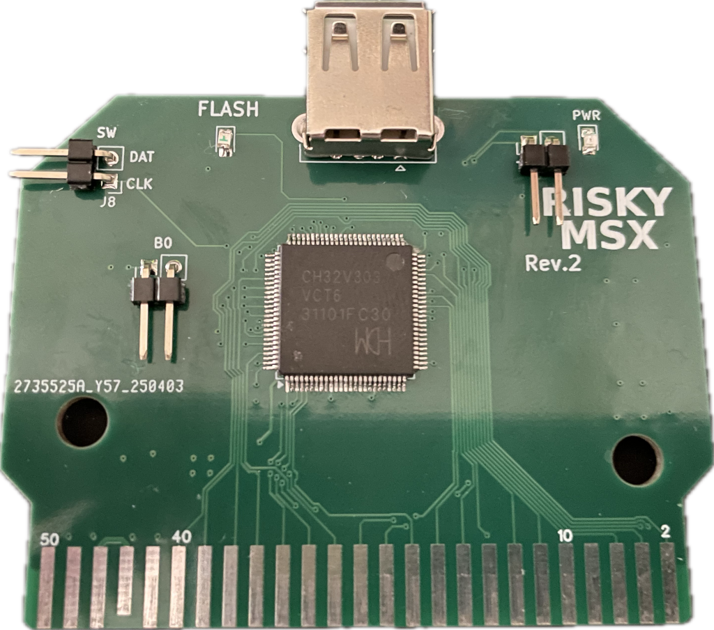](images/RISKYMSXCart-Rev2.1-front-populated-1024px.png)


## Main Features

* Support for up to 256KB ROMs
* SCC emulation
* Firmware updates using a USB-A cable (or alternatively a WCH-LinkE programmer)
* ROM Flashing:
  * No external flash programmer is needed
  * A ROM can be flashed in-system using a MSX computer and a FAT-formatted USB pen drive
  * `ROM Flashing Mode` is activated by pressing GRAPH key during MSX boot
  * Automatic flashing of ROMs from USB can be achieved via specially named ROM archives
  * Manually flashing of ROMs from USB is done using a simple interactive menu
  * FAT long filenames are supported
* Supported mappers:
  * Standard 16KB ROMs
  * Standard 32KB ROMs
  * Standard 48KB /64KB ROMs
  * KONAMI without SSC
  * KONAMI with SSC (EN - SCC emulation enabled)
  * KONAMI with SSC (DIS - SCC emulation disabled)
  * ASCII 8K
  * ASCII 16K
  * Neo 8k
  * Neo 16k


## Hardware

The RISKYMSX cartridge is made up of a 4-layer PCB with a reduced set of SMD components and through-hole connectors:
* A WCH [CH32V303VCT6](https://www.wch-ic.com/products/CH32V303.html) MCU (or alternatively a [CH32V307VCT6](https://www.wch-ic.com/products/CH32V307.html))
* Two LEDs, one to indicate power on state, and one lit during `ROM Flashing Mode`
* A [LM1117](https://www.ti.com/lit/ds/symlink/lm1117.pdf) voltage regulator to provide +3V3 to the MCU from the +5V rail of the MSX cartridge slot
* A [MCP6001](https://ww1.microchip.com/downloads/aemDocuments/documents/MSLD/ProductDocuments/DataSheets/MCP6001-1R-1U-2-4-1-MHz-Low-Power-Op-Amp-DS20001733L.pdf) operational amplifier to enhance the SCC audio signal fed into the MSX cartridge SOUNDIN pin
* Three headers:
  * B0: open by default, closed only while programming the MCU using the `WCHISPTool_CMD` tool
  * DAT/CLK: unconnected by default, used to program the MCU using the [`WCH-LinkE`](https://www.wch-ic.com/products/WCH-Link.html) programmer via SWDIO/SWCLK
  * RX/TX: unconnected by default, serial debug console
* One USB Type-A female connector
* Several passives required for proper operation of the above components

### Revisions

There are several hardware revisions of the cartridge. The main ones are listed here in reverse chronological order.

#### Rev 2.1 (current)

This version introduces the following changes:
* the flash button is removed, as the flashing interface can be accessed by pressing the GRAPH key on the MSX keyboard during boot
* unnecessary leds are removed, leaving just the Flash and Power leds
* the audio amplifier circuit is enhanced with a low pass filter 

See the [Bill Of Materials (BoM)](https://html-preview.github.io/?url=https://raw.githubusercontent.com/arkadiuszmakarenko/RISKYMSX/main/board/bom/ibom.html) generated from the KiCad files for information about the specific components used.

Have a look at the [schematic and PCB](https://kicanvas.org/?github=https%3A%2F%2Fgithub.com%2Farkadiuszmakarenko%2FRISKYMSX%2Ftree%2Fmain%2Fboard) using [KiCanvas](https://kicanvas.org).

[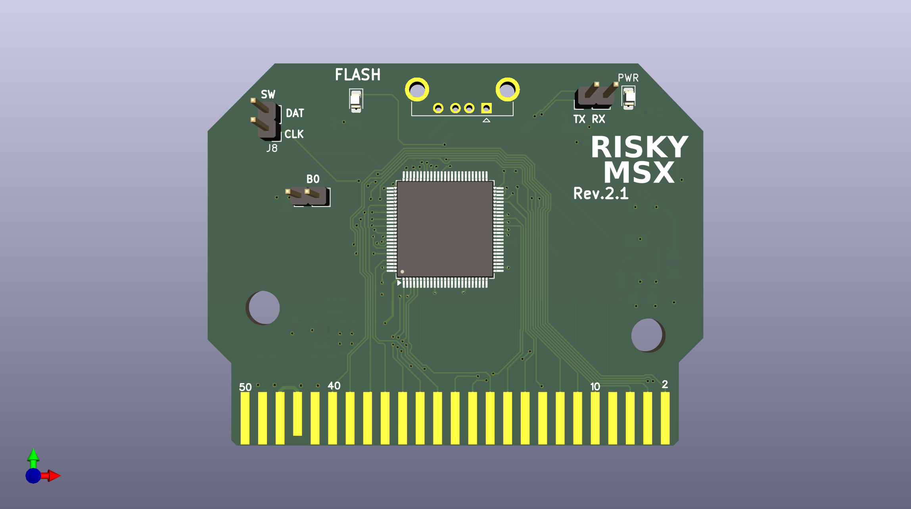](images/RISKYMSXCart-Rev2.1-front-render.png)
[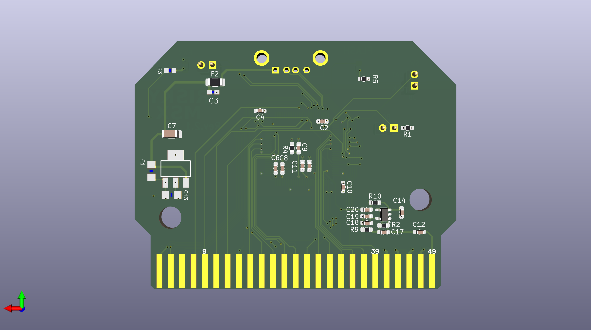](images/images/RISKYMSXCart-Rev2.1-back-render.png)

#### Rev 2 (obsolete)

This version introduces the following changes:
* the LM1117 voltage regulator and related passives are moved to the back of the PCB
* the B1 header is removed as it has no practical use
* a simple audio amplifier circuit is added for SCC sound

[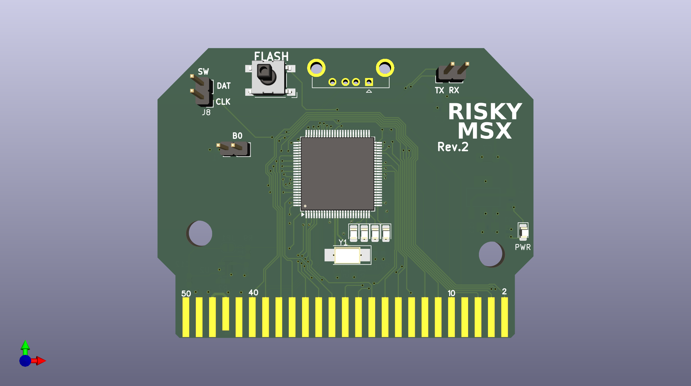](images/RISKYMSXCart-Rev2-front-render.png)|[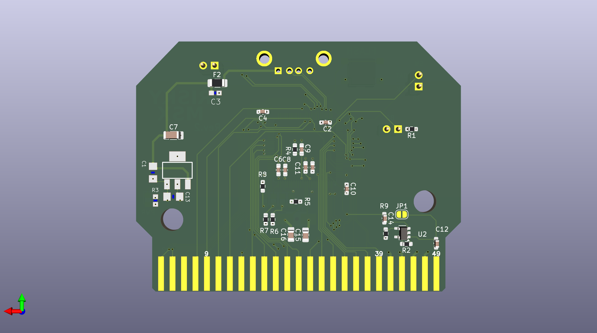](images/RISKYMSXCart-Rev2-back-render.png)
|-|-|
|RISKYMSX Rev 2 front render|RISKYMSX Rev 2 rear render|

#### Rev 1 (obsolete)

This is the initial revision of the RISKYMSX cartridge.

[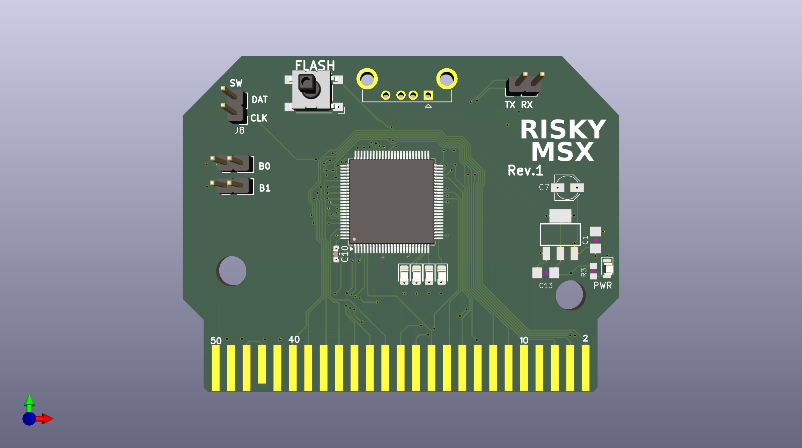](images/RISKYMSXCart-Rev1-front-render.png)|[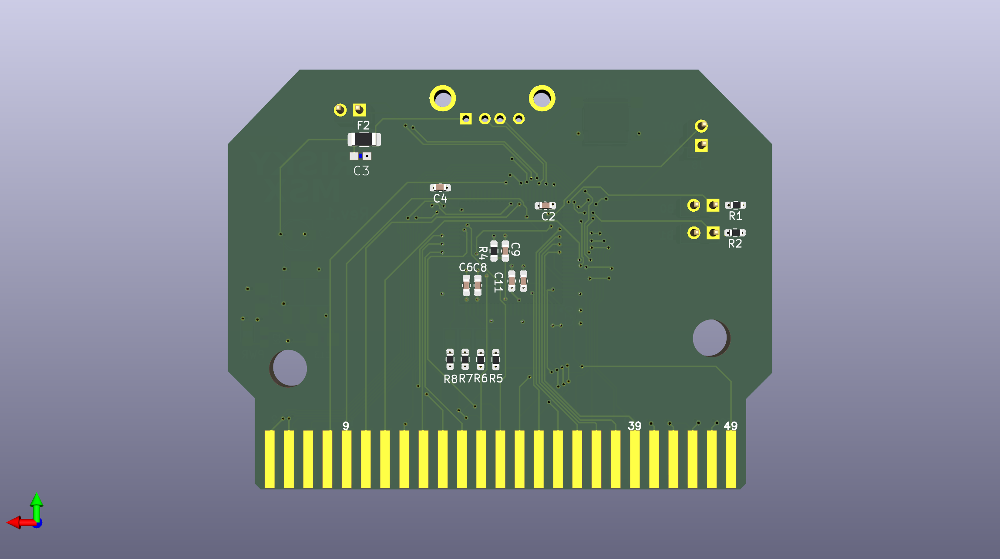](images/RISKYMSXCart-Rev1-back-render.png)
|-|-|
|RISKYMSX Rev 1 front render|RISKYMSX Rev 1 rear render|


## Firmware

The firmware implements two different modes of operation for the RISKYMSX cartridge:
* `Normal Mode`. In this mode a ROM cartridge is emulated according to the last ROM flashed using the `ROM Flashing Mode`.
* `ROM Flashing Mode`. In this mode a ROM can be flashed manually or automatically into the cartridge by using a FAT formatted USB pen drive.


## Building a RISKYMSX cartridge

You will need good soldering skills and specific equipment to build a RISKYMSX cartridge.
As you probably saw on the Bill Of Materials, there are quite small SMD components like 0603 passives and a LQFP-100 package with 0.5mm pitch that need to be soldered.

> [!WARNING]
> If you are building new boards, please use the current available board revision.

### PCB

The PCB can be fabricated by your favorite PCB manufacturer from the [supplied gerber files](https://github.com/arkadiuszmakarenko/RISKYMSX/blob/main/RiskyMSXv21PCB.zip).

### Suggested tools

These are example tools used during the manual building of the RISKYMSX cartridge:

* silicone heat-resistant mat (TE-616 400x290mm), to avoid burning your precious desk
* electronic microscope with 2 LEDs (KKmoon 3" LCD 10X-300X 3.0MP 1080P HDMI electronic digital video microscope), to be able to solder those small 0.5mm pitch pins
* temperature controlled soldering station (Yihua 908D), to make good soldering joints
* T-1C "horseshoe", T-I and T-1.6D soldering tips (900M series), use the best fitting one for each soldering job
* copper sponge, for soldering head cleaning
* flux (Mechanic UV80 flux paste), to help keep components in place and achieve good soldering joints
* solder (0.5mm, for hobby projects you may use 60% Sn / 40% Pb Flux 2% at your own risk)
* desoldering wick (2.5mm is fine), for correcting mistakes if you are human)

### Component shopping list

> [!WARNING]
> Aliexpress links may not work, as sellers come and go.

| **ref**                                   | **component**  | **req_pcs** | **item_description**                                                                                                             | **item_option**      | **pcs_per_item** | **req_items** | **link**                                                                                                       |
| ----------------------------------------- | -------------- | ----------- | -------------------------------------------------------------------------------------------------------------------------------- | -------------------- | ---------------- | ------------- | -------------------------------------------------------------------------------------------------------------- |
| C2, C4, C5, C6, C7, C8, C9, C10, C11, C19 | 0603 100nF     | 10          | 100pcs 0603 SMD Chip Multilayer Ceramic Capacitor 0.5pF - 22uF 10pF 22pF 100pF 1nF 10nF 15nF 100nF 0.1uF 1uF 2.2uF 4.7uF 10uF    | 0603 100nF 50V       | 100              | 1             | [aliexpress](https://aliexpress.com/item/32966526545.html)                   |
| C18                                       | 0603 1uF       | 1           | 100pcs 0603 SMD Chip Multilayer Ceramic Capacitor 0.5pF - 22uF 10pF 22pF 100pF 1nF 10nF 15nF 100nF 0.1uF 1uF 2.2uF 4.7uF 10uF    | 0603 1uF 25V         | 100              | 1             | [aliexpress](https://aliexpress.com/item/32966526545.html)                   |
| C12, C20                                  | 0603 4.7uF     | 2           | 100pcs 0603 SMD Chip Multilayer Ceramic Capacitor 0.5pF - 22uF 10pF 22pF 100pF 1nF 10nF 15nF 100nF 0.1uF 1uF 2.2uF 4.7uF 10uF    | 0603 4.7uF 10V       | 100              | 1             | [aliexpress](https://aliexpress.com/item/32966526545.html)                   |
| C3                                        | 0603 10uF      | 1           | 100pcs 0603 SMD Chip Multilayer Ceramic Capacitor 0.5pF - 22uF 10pF 22pF 100pF 1nF 10nF 15nF 100nF 0.1uF 1uF 2.2uF 4.7uF 10uF    | 0603 10uF 10V        | 100              | 1             | [aliexpress](https://aliexpress.com/item/32966526545.html)                   |
| C1                                        | 1206 100nF     | 1           | 100pcs 1206 SMD Chip Multilayer Ceramic Capacitor 0.5pF - 100uF 10pF 100pF 1nF 10nF 15nF 100nF 0.1uF 1uF 2.2uF 4.7uF 10uF 47uF   | 1206 100nF 50V       | 100              | 1             | [aliexpress](https://aliexpress.com/item/32966490820.html)                   |
| C13                                       | 1206 1uF       | 1           | 100pcs 1206 SMD Chip Multilayer Ceramic Capacitor 0.5pF - 100uF 10pF 100pF 1nF 10nF 15nF 100nF 0.1uF 1uF 2.2uF 4.7uF 10uF 47uF   | 1206 1uF 25V         | 100              | 1             | [aliexpress](https://aliexpress.com/item/32966490820.html)                   |
| R1, R2, R4, R9, R10                       | 0603 10K       | 5           | 100PCS 0603 1% SMD resistor 0R ~ 10M 1/10W 0 1 10 100 150 220 330 470 ohm 1K 2.2K 10K 100K 1M 0R 1R 10R 100R 150R 220R 330R 470R | 10K                  | 100              | 1             | [aliexpress](https://aliexpress.com/item/1005005677654015.html)         |
| R3, R5                                    | 0603 220       | 2           | 100PCS 0603 1% SMD resistor 0R ~ 10M 1/10W 0 1 10 100 150 220 330 470 ohm 1K 2.2K 10K 100K 1M 0R 1R 10R 100R 150R 220R 330R 470R | 220R                 | 100              | 1             | [aliexpress](https://aliexpress.com/item/1005005677654015.html)         |
| D1                                        | 0805 green LED | 1           | 5 colors x20pcs =100pcs SMD 0805 led kit Red/Green/Blue/Yellow/White LED Light Diode Free Shipping! KIT                          | n/a                  | 20               | 1             | [aliexpress](https://aliexpress.com/item/32288211535.html)                   |
| D5                                        | 0805 red LED   | 1           | 5 colors x20pcs =100pcs SMD 0805 led kit Red/Green/Blue/Yellow/White LED Light Diode Free Shipping! KIT                          | n/a                  | 20               | 0             |                                                                                                                |
| U1                                        | CH32V307VCT6   | 1           | 1-50Pcs New CH32V303VCT6 CH32V303 VCT6 CH32V LQFP-100 Microcontroller IC Chip In Stock Wholesale                                 | 2Pcs CH32V303VCT6    | 2                | 1             | [aliexpress](https://aliexpress.com/item/1005006687185523.html)         |
| U2                                        | MCP6001-OT     | 1           | 20PCS 100% New MCP6001T-I/OT SOT23-5 MCP6001T-I SOT23 MCP6001 SMD MCP6001T Chipset                                               | n/a                  | 20               | 1             | [aliexpress](https://aliexpress.com/item/1005006809254782.html)         |
| F2                                        | 3216 0.5A      | 1           | 3216 1206 0.05A 0.1A 0.12A 0.16A 0.2A 0.25A 0.5A 0.75A 1.1A 2A SMD Resettable Fuse PPTC PolySwitch Self-Recovery Fuse            | 500MA, 1206, 20 Pcs  | 20               | 1             | [aliexpress](https://aliexpress.com/item/1005004273302126.html) |
| IC8                                       | LM1117MPX-3.3  | 1           | 5PCs LM1117MPX-1.8 N12A LM1117MPX-2.5 N13A LM1117MPX-3.3 N05A/B LM1117MPX-5.0 N06A LM1117MPX-AJ N03A SOT-223 Linear Regulator    | LM1117MPX-3.3        | 5                | 1             | [aliexpress](https://aliexpress.com/item/1005007393149096.html)         |
| J1, J2, J8                                | Conn_01x02     | 1           | 10pcs 40 Pin 1x40 Single Row Male and Female 2.54 Breakable Pin Header PCB JST Connector Strip for arduino DIY Kit               | Male Color 2pcs each | 10               | 1             | [aliexpress](https://aliexpress.com/item/1005007324368709.html) |
| J7                                        | USB_1          | 1           | Hot Sale USB Type A Standard Port Female Solder Jacks Connector PCB Socket Type B 90 Degree Horizontal Straight Insertion Patch  | 10PCS USB-02         | 10               | 1             | [aliexpress](https://aliexpress.com/item/1005005865561469.html) |

Beware of fake chips and components:
* If you receive MCP6001 op-amps marked as SA10, they are probably MCP601 op-amps.
* MCP6001 op-amps marked as AAYS should be fine.
* LM1117MPX-3.3 voltage regulators marked as N05A should be fine.


### Assembling the hardware

The central piece of the cartridge is the CH32V30xVCT6 MCU which is at the same time the most difficult element to solder.

You can solder components in the following suggested order, or do as you feel comfortable:
* U1 CH32V30xVCT6
* D1,D5 leds
* F2 fuse
* R3, R5 led resistors
* R1 boot0 pull-down resistor
* IC8 LM1117MPX-3.3
* C3 10uF capacitor
* C7 and C1 100nF capacitors
* C13 1uF capacitor
* C4, C2, C6, C8, C5, C11 and C10 100nF capacitors
* R4 and C9 do not need to be populated (confirmation needed)
* U2 MCP6001-OT op-amp
* C12 and C20 capacitors
* C19 capacitor
* C18 capacitor
* R10, R9 and R2 resistors
* C14 and C17 capacitors

> [!WARNING]
> C5 is not marked on the PCB, it is the capacitor to the right of the C11 marking (C11 mark is closer to C5 than to C11)
>
> C11 is the capacitor to the right of the C5 capacitor

### Building the firmware on Linux

> [!NOTE]
> These instructions have been validated using Ubuntu 24.04.2 LTS.

#### Cloning the RISKYMSX github repository

```bash
cd $HOME
git clone 'https://github.com/arkadiuszmakarenko/RISKYMSX.git'
```

This will clone the RISKYMSX github repository to the `RISKYMSX` directory under your home directory.


#### Installing the [MounRiverStudio IDE](http://www.mounriver.com)

1. Download the MounRiverStudio package for Linux

[http://www.mounriver.com/download](http://www.mounriver.com/download)

Choose the package in `tar.xz` format.

2. Uncompress the MounRiverStudio package into a known directory

For example this will uncompress the MounRiverStudio package into the IDE directory under your home directory.

```bash
export IDEDIR=$HOME/IDE
mkdir -p $IDEDIR && cd $IDEDIR
tar xJvf /path/to/MounRiverStudio_Linux_X64_V210.tar.xz
```

Once uncompressed, all package files are under the `MRS2` directory.

3. Setup the MounRiverStudio

You can follow the instructions described on the `README` file.
Alternatively, if you don't want to install library files system-wide you can follow these instructions:

* Change to the `MRS2/beforeinstall` directory

```bash
cd MRS2/beforeinstall
```

* Make a backup of the `start.sh` script file for reference

```bash
cp start.sh start.sh.orig
```

* Modify the `start.sh` script file.

Comment out the lines that install libraries and the line that gives world write access to all files under the `MRS-linux-x64` directory.
Leave as is the code that copies the udev rules for the WCH programmers and reloads them into udevadm.

```bash
#! /bin/bash
#echo  -e "\nCopy Libs"
#sudo cp -P ./lib*    /usr/lib
#echo  -e "Register new Libs"
#sudo ldconfig
echo "copy rules"
sudo cp ./50-wch.rules /etc/udev/rules.d
sudo cp ./60-openocd.rules  /etc/udev/rules.d
echo "Reload rules"
sudo udevadm control  --reload-rules

#chmod -R 777 ../MRS-linux-x64
chmod -R 750 ../MRS-linux-x64

echo -e "DONE"
```

* Run the modified `start.sh` script

```bash
chmod u+x start.sh
./start.sh
```

* Make the `chrome-sandbox` executable suid to root by changing the ownership of the file to root and setting the SUID bit.

This is required as the MounRiverStudio IDE is an Electron-based application that uses a sandbox approach.

```bash
cd ../MRS-linux-x64
sudo chown root chrome-sandbox
sudo chmod 4755 chrome-sandbox
```

#### Launching the MounRiverStudio IDE

If you installed the MounRiverStudio IDE under `$HOME/IDE`, use the following complete command line whenever you need to launch MounRiverStudio IDE specifying where to find the extra libraries needed.

```bash
cd $HOME/IDE/MRS2/MRS-linux-x64
LD_LIBRARY_PATH=$(readlink -f ../beforeinstall/) ./mounriver-studio\ 2
```

[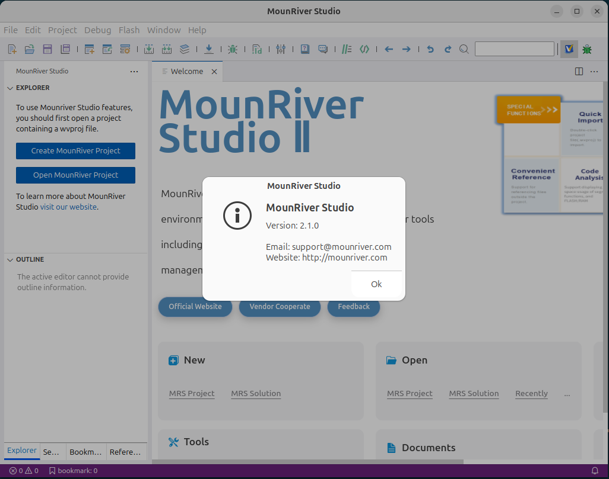](images/mounriverstudio-ide-about.png)


#### Generating the firmware file

1. After launching the MounRiverStudio IDE, open the RISKYMSXCART project file

`File | Open MounRiver Project`

**`/path/to/your/RISKYMSX/firmware/RISKYMSXCART.wvproj`**

The project file is under the `firmware` directory on the cloned github repository.

2. Build the project

`Project | Build Project`

[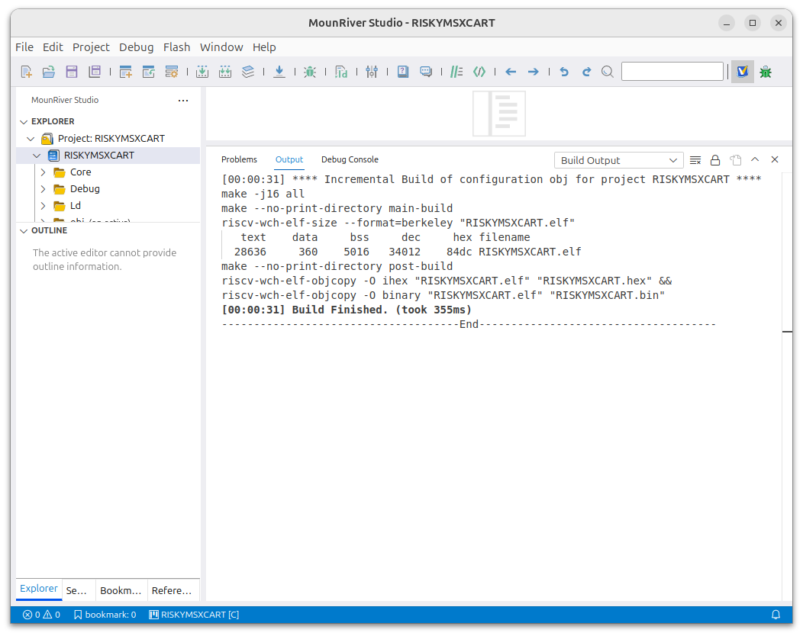](images/mounriverstudio-ide-build-project.png)


#### Programming the firmware

The firmware can be programmed into the RISKYMSX cartridge using the MounRiverStudio IDE and a WCH-LinkE programmer, or using the WCHISPTool_CMD and a USB Type A to Type A cable.

> [!NOTE]
> It has been observed that the WCH-LinkE programmer method is more reliable than the WCHISPTool_CMD method when flashing a chip for the first time.

Choose the option that better suits you.

##### Programming the firmware using the WCH-LinkE programmer

Using the WCH-LinkE allows to program a .HEX firmware file to the CH32V30xVCT6.

1. Connect the WCH-LinkE programmer and RISKYMSX cartridge

  * Make sure the RISKYMSX cartridge is _disconnected_ from the MSX.

  * Using two dupont wires, connect the WCH-LinkE programmer to the RISKYMSX cartridge.

    You need to perform specifically the following connections:
    * the SWCLK/TCK pin of the WCH-LinkE programmer to the CLK pin of the J8 header of the RISKYMSX cartridge
    * the SWDIO/TMS pin of the WCH-LinkE programmer to the DAT pin of the J8 header of the RISKYMSX cartridge

[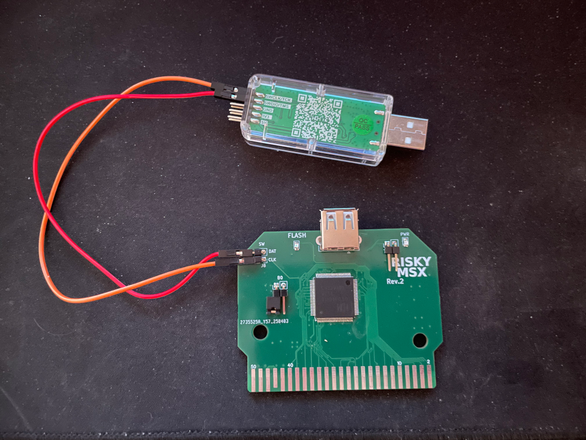](images/wch-linke-connection-to-riskymsx-cartridge.png)

* Connect the USB port of the RISKYMSX cartridge to a free USB port of the computer running the MounRiverStudio software.

You will need a USB Type A end on the RISKYMSX cartridge and the appropriate USB end on your computer.

This USB connection will be used just to power the CH32V30xVCT6.
After the connection is made, the RISKYMSX cartridge should lit the power led PWR on.

[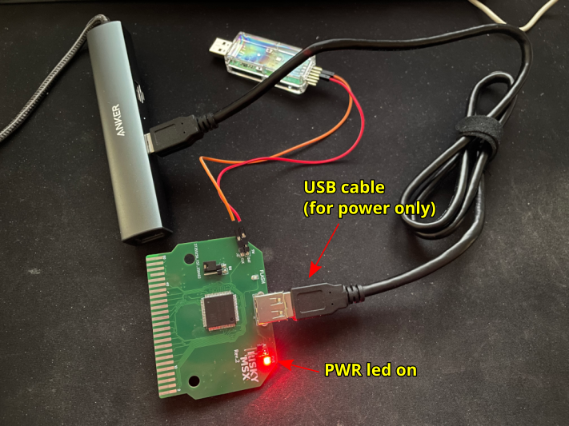](images/wch-linke-connection-to-riskymsx-cartridge-2.png)

* Connect the WCH-LinkE programmer to the computer running the MounRiverStudio IDE on a free USB Type A port.

Once connected, the WCH-LinkE should lit the red led on and the blue led off to indicate operation in RISC-V mode.

[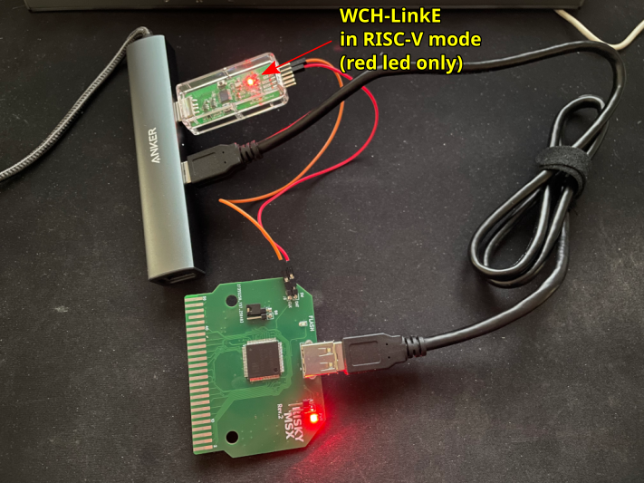](images/wch-linke-connection-to-riskymsx-cartridge-3.png)

If the WCH-LinkE shows any other led combination, you should follow the [WCH-LinkE manual](https://www.wch-ic.com/downloads/WCH-LinkUserManual_PDF.html) to put your WCH-LinkE in RISC-V mode.

One simple way to switch to RISC-V mode is to press and hold the ModeS button while connecting the WCH-LinkE programmer.
Note that on some WCH-LinkE programmers the plastic enclosure does not allow access to the ModeS button and you will need to either remove the enclosure to access the ModeS button or use the MounRiverStudio software to switch to RISC-V mode by software.

[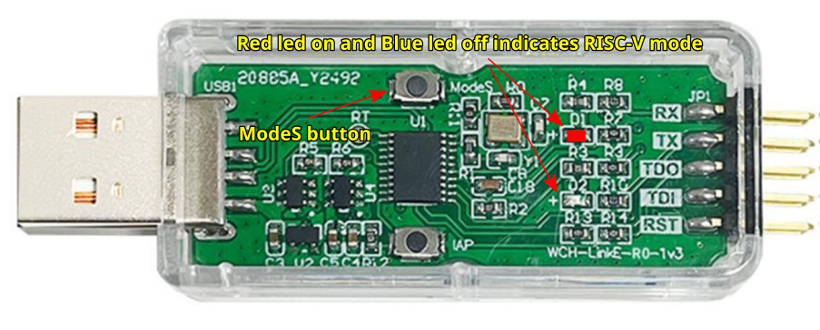](images/wch-linke-red-led-riscv-mode.png)

2. Launch the MounRiverStudio IDE and open the Download preferences to specify the memory assignment settings and location of the target file

`Flash | Download Configuration`

`Download Settings`

`MCU Memory Assign: ` **`288K ROM + 32K RAM`**

`Target File : `**`/path/to/your/RISKYMSX/firmware/obj/RISKYMSXCART.hex`**

[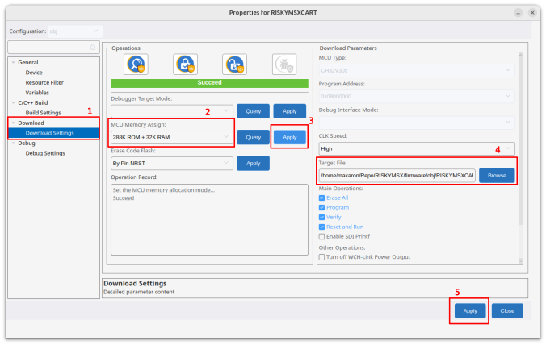](images/mounriverstudio-ide-download-settings-and-memory-assign.png)

3. Proceed with the firmware download to the RISKYMSX cartridge

`Flash | Download`

[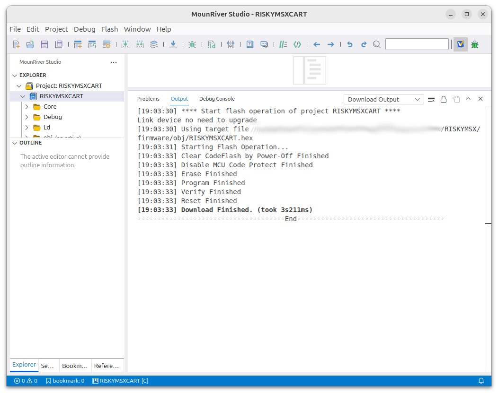](images/mounriverstudio-ide-download.png)

If you receive an error, try power cycling the RISKYMSX cartridge by disconnecting and reconnecting the USB cable from the RISKYMSX cartridge, and then retry the operation.

##### Programming the firmware using the WCHISPTool_CMD tool

Using the WCH-LinkE allows to program a .BIN firmware file to the CH32V30xVCT6.

1. If you haven't done it yet, download and uncompress the WCHISPTool_CMD archive

* Download the [WCHISPTool_CMD](https://www.wch-ic.com/downloads/WCHISPTool_CMD_ZIP.html)

* Uncompress the `WCHISPTool_CMD.ZIP` archive

```bash
unzip WCHISPTool_CMD.ZIP
```

Once uncompressed all package files are under the `WCHISPTool_CMD/` directory.

* Make sure the `WCHISPTool_CMD` tool is executable

```bash
chmod u+x WCHISPTool_CMD/Linux/bin/x64/WCHISPTool_CMD
```

This will make the tool binary for x64 processors executable by the current user.

2. Build the required Linux kernel module

The mentioned Linux kernel mode is used to talk to the ISP interface of the CH32V30xVCT6 chip.

You will need to build the kernel module everytime you upgrade your kernel, otherwise the kernel module will not load because of the mismatch between kernel and module.

```bash
cd WCHISPTool_CMD/Linux/driver/
make clean
make
```

Note that you are not required to run `make install` to install the kernel module if you just want to use the tool sparingly.

3. Load the compiled kernel module into the running kernel

```bash
sudo insmod ch37x.ko
```

4. Close the B0 header pins using a 2.54" jumper.

By closing the B0 header, the CH32V30xVCT6 MCU will enter ISP programming mode once powered on.

5. Connect the RISKYMSX cartridge to your computer using a USB cable.

The required USB cable needs a Type A male termination on one side to connect to the RISKYMSX cartridge, and another USB male connector suitable for your computer on the other end.
If your computer has USB Type A ports, a USB Type A to USB Type A cable should be fine.

[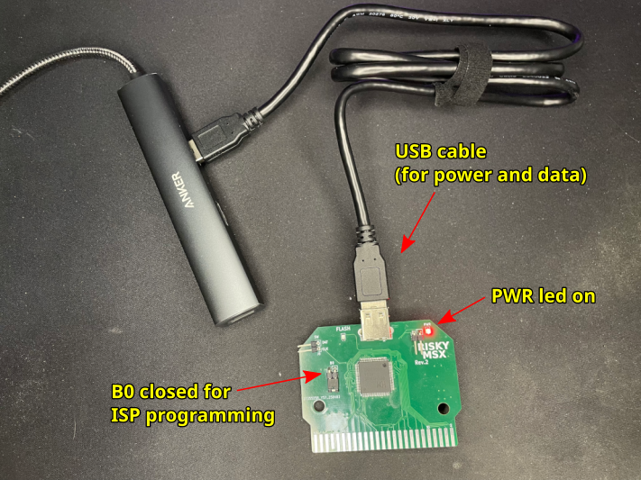](images/isp-riskymsx-connection-for-programming.png)

6. Check that the device node for the CH32V30xVCT6 in ISP programming node appears on your system

```bash
ls -la /dev/ch3*
```
```
crw------- 1 root root 180, 2 Jun  3 15:58 /dev/ch37x2
```

6. Run the `WCHISPTool_CMD` tool to program the RISKYMSX cartridge firmware

The following command assumes that both the `WCHISPTool_CMD` and `RISKYMSX` github repository directories are available under the current working directory, and that the RISKYMSX firmware binary file has been copied to the current directory under the name `RISKYMSXCART.bin`.

```bash
sudo WCHISPTool_CMD/Linux/bin/x64/WCHISPTool_CMD -p /dev/ch37x2 -f RISKYMSXCART.bin -o program -c RISKYMSX/prog/CONFIG.INI -r 1
```

where:
* `/dev/ch37x2` is the device node for your CH32V30x as it appears on your system
* `RISKYMSXCART.bin` is the firmware binary file provided in the github repository (or the one built by you if you rebuilt the project)
* `RISKYMSX/prog/CONFIG.INI` is the configuration file for the `WCHISPTool_CMD` also provided in the github repository

When the programming completes successfully you will see an output similar to this one:

```
=====ISP_Command_Tool=====

TOOL VERSION:  V3.70

p:/dev/ch37x2
b:0
v:0
c:RISKYMSX/prog/CONFIG.INI
o:0
f:RISKYMSXCART.bin
r:1

{"Device":"/dev/ch37x2","Status":"Ready"}
{"Device":"/dev/ch37x2", "Status":"Programming", "Progress":100%} 
{"Device":/dev/ch37x2", "Status":"Finished", "Code":0,"Message":"Succeed"}
```

### Building the firmware on Windows

TBE

#### Programming the firmware

You need WCHISPTool from https://wch-ic.com/ website.

##### USB A - USB A Cable or Serial adapter
 * Close jumper B0.
 * Connect RISKY MSX to PC using USB A to USB A cable or serial.
 * For USB A Cable Dnld Port should change to USB.
 * For serial select your serial device COM
 * Select Chip Series - CH32V30x
 * Chip Model : CH32V303VCT6
 * Select Object File1 and pick up firmware .bin.
 * Under Chip Config select Chip Memory Allocation RAMX 32KB + ROM 288KB
 * Click Deprotect
 * Click Download


## Cartridge Operation

The RISKYMSX cartridge can operate in two different modes once programmed with the RISKYMSX firmware.

Make sure the MSX computer is powered off before inserting or removing the RISKYMSX cartridge or any other cartridge.

> [!WARNING]
> All cartridge headers (B0, DAT/CLK and RX/TX) must be unconnected for cartridge operation when inserted into a MSX computer.


### Normal Mode

In `Normal mode` the RISKYMSX cartridge behaves as a ROM cartridge once a ROM has been flashed.

Just insert the RISKYMSX cartridge and enjoy the already flashed ROM.

### ROM Flashing Mode

In `ROM Flashing Mode` a ROM file residing in a USB drive can be flashed to the RISKYMSX cartridge for later use in `Normal Mode`.

1. Make sure the MSX computer is powered off

2. Insert the RISKYMSX cartridge

3. Press and hold the `GRAPH` key on the MSX computer keyboard and power on the MSX computer.

You can release the `GRAPH` key once you see the Flash LED turn on.

[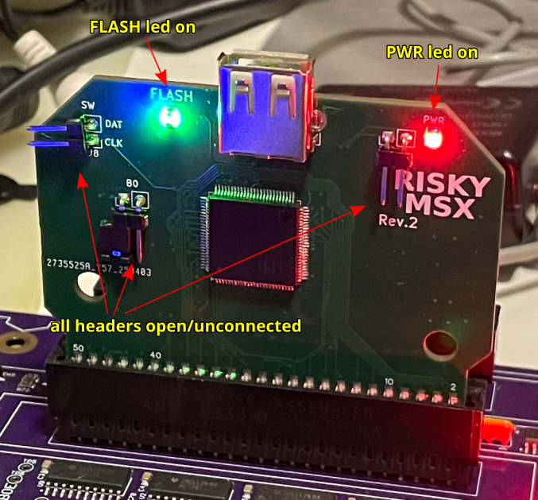](images/riskymsx-in-flashing-rom-mode.png)

4. If no USB drive is connected to the RISKYMSX cartridge, the "Insert USB" screen will appear.

[](images/firmware-insert-usb-screen.png)

You will need to connect a FAT-formatted USB drive to continue the ROM flashing procedure.

Once that is done, the RISKYMSX will try first to auto-flash a ROM before switching to manually flashing ROMs.

#### Auto-flashing ROMs

The RISKYMSX firmware will automatically flash the first file found on the root directory of the connected FAT-formatted USB drive matching one of the special filenames for ROM auto-flashing, according to the following table. A mapper will be automatically assigned based on the filename detected.

 | Mapper               | filename         | 
 |   :-----------:      | :--------------: | 
 | 16KB ROM             | cart.r16         | 
 | 32KB ROM             | cart.r32         | 
 | KONAMI without SSC   | cart.ko4         | 
 | KONAMI with SSC(EN)  | cart.ko5         | 
 | KONAMI with SSC(DIS) | cart.kd5         | 
 | ASCII8k              | cart.a8k         | 
 | ASCII16k             | cart.a16         | 
 | NEO16                | cart.n16         | 
 | NEO8                 | cart.n8k         | 

So for example, to automatically flash F1SPIRIT.ROM, which is a KONAMI with SCC game, the F1SPIRIT.ROM file can be copied to the root of the USB drive using the filename **cart.ko5**, and then follow the mentioned procedure.

[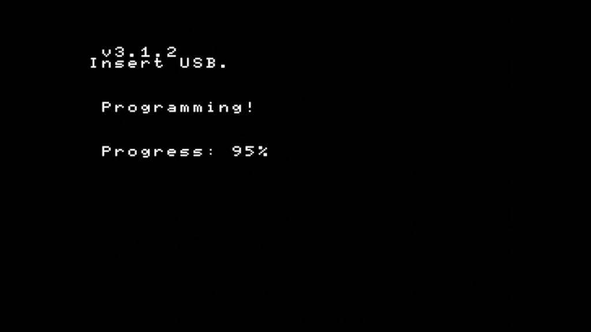](images/riskymsx-in-auto-flashing-rom-mode.png)

After flashing the ROM file, the RISKYMSX will automatically reboot the MSX computer and the ROM will load.

Note that if several files matching the auto-flashing filenames are found on the USB drive, only the file that causes the first match in the above table order will be flashed.

#### Manually flashing ROMs

If the connected FAT-formatted USB drive contains no files matching the auto-flashing filenames, the RISKYMSX firmware will display the interactive ROM flashing menu.

[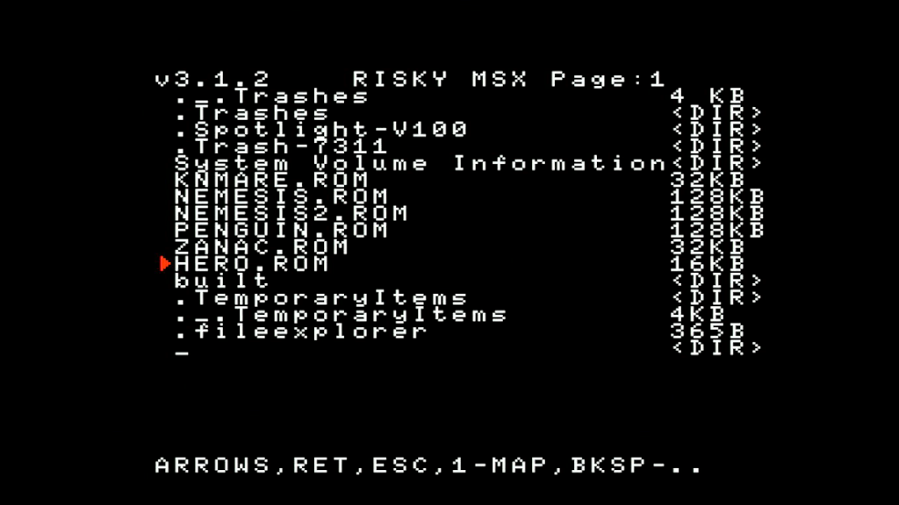](images/firmware-manually-selecting-file-screen.png)

Use the following keys to interact with the file menu screen:
* `Up`, `Down`: move up or down the red arrow cursor across the available files in the current page
* `Right`: go to the next page (if more files are available to list)
* `Left`: go to the previous page (if any pagination was done before)
* `Return`: select a file for flashing
* `Esc`: go to the previous screen, or reload the file list on the root directory
* `1`: show the current flashed ROM file and mapper type, and optionally change the mapper type
* `Backspace`: go to the previous directory level on the file manu

Useful tips:
* The bottom of the file menu screen shows the keys that are available to use at any moment
* You can always hot-swap the USB drive while in the file menu, and once a new USB drive is connected you need to press `Esc` to refresh the file contents
* DO NOT navigate or select files while you have disconnected a USB drive without pressing `Esc` first
* If you flash a ROM with the wrong mapper type, you can change the mapper type easily, without reflashing the ROM again, by pressing `1`

When a ROM file is selected by pressing the `Return` key the mapper selection screen shows up.

[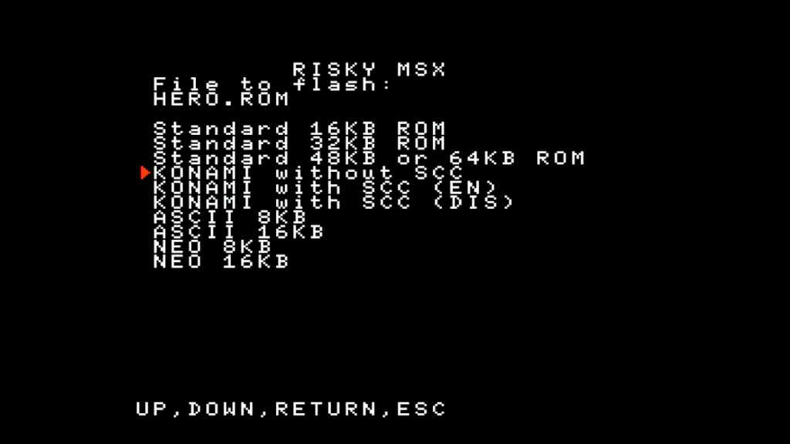](images/firmware-manually-selecting-mapper-type-screen.png)

Select the correct mapper type for the selected ROM file and press `Return` to start flashing the ROM.

[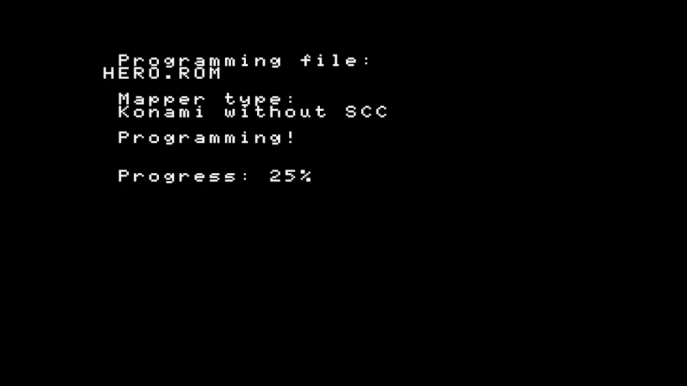](images/firmware-manually-flashing-rom-screen.png)

Once the flashing process finishes the RISKYMSX firmware will reboot the MSX computer and the flashed ROM will load.


## General troubleshooting.

If no LEDS are on during power up, You have issues with power lines or shorts.
If during power up and button pressed no LEDs are flashing your MPU doesn't start at all.
If you can download ROM to cart but MSX doesn't load data from cart then you have issues wih soldering of ADDRESS, DATA or BUS lines.


## Compatibility

The RISKYMSX cartridge has been tested on the following MSX computers:

| **Model**                | **RISKYMSX**              |
|--------------------------|---------------------------|
| Sony MSX HB-101P         |          OK               |
| Sony MSX HB-501F         |          OK               |
| Toshiba MSX HX-10        |          OK               |
| Philips MSX2 VG-8235     |          OK               |
| Panasonic MSX2+ FS-A1WSX |          OK               |
| Omega MSX2+              |          OK               |
| Tides Rider MSX2+        |          OK               |
| TFMSX Rev 1 MSX2+        |          OK               |
| TFMSX Rev 2 MSX2+        |          OK               |
| MSXVR                    |          `NOK`            |

Other MSX compatible computers will probably work too, but have not been specifically tested.


## Enclosures

### Acrylic Enclosure

You can complete your RISKYMSX cartridge with an [acrylic enclosure](https://github.com/herraa1/msx-riskymsx-enclosure) suitable for all RISKYMSX cartridge board revisions.

[](https://github.com/herraa1/msx-riskymsx-enclosure)


### 3D Printed Enclosure

Another option for closing your RISKY MSX Cartridge is following project  [Enclosure](https://github.com/rafaelan00/RISKYMSX-Enclosure)


## Acknowledgments

The following people contributed to this project and supported me with technical aspects of this project.
* Terrible Fire
* cnlohr 
* NYYRIKKI
* Aoineko
* BG Ollie
* MadHacker

Testing team:
* PhilC
* Higgy
* ahmsx
* Hee-Bong An
  
Thank you very much for your support.


